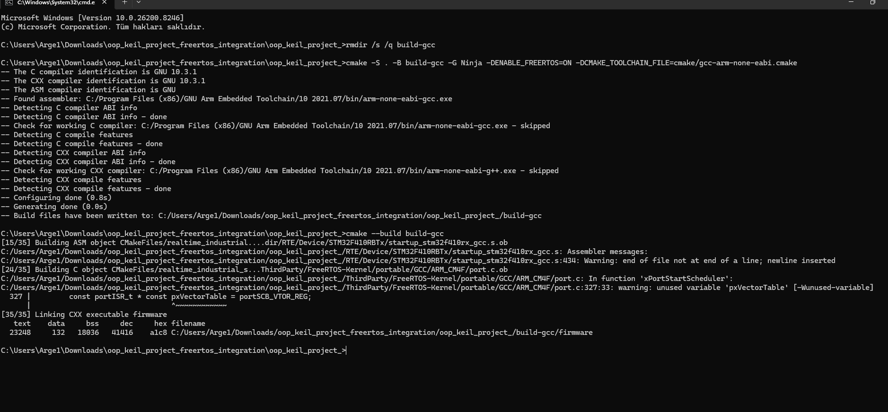

# Embedded C++ RTOS Industrial Sensor (STM32F4)

This project implements a real-time industrial-grade temperature and humidity monitoring system on an STM32F4 microcontroller. The firmware is developed using modern C++ with a layered architecture and supports both bare-metal and FreeRTOS-based execution.

The system is designed with determinism, reliability, and scalability in mind, targeting industrial communication and continuous operation scenarios.

---

## Overview

The firmware provides:

* Real-time sensor acquisition (SHT3x via I2C)
* Modbus RTU communication over RS485
* Deterministic timing using hardware timers and RTOS scheduling
* Fault-tolerant design with watchdog supervision
* Flash-based configuration storage with integrity validation (CRC)
* Modular and layered software architecture

---

## Key Features

* Modern C++ embedded design (no vendor HAL dependencies)
* Bare-metal and FreeRTOS execution modes
* Register-level peripheral drivers:

  * I2C
  * UART / RS485
  * ADC
  * DMA
  * PWM
* Full Modbus RTU protocol stack
* RTOS task-based architecture:

  * Sensor task
  * Modbus communication task
  * ADC processing task
  * Health monitoring task
* Watchdog-based system recovery
* Flash configuration storage with CRC validation
* Deterministic loop timing and performance monitoring

---

## Architecture

The project follows a layered architecture:

* App
  Entry point and high-level orchestration

* Services
  Business logic (sensor handling, Modbus, watchdog, flash, error management)

* Drivers
  Low-level hardware interaction (register-level implementation)

* Config
  Configuration structures and persistent storage

* Legacy
  Reused low-level C modules

* Rtos
  Task management and scheduling layer

* Common
  Shared utilities and abstractions

---

## RTOS Integration

FreeRTOS is integrated as an optional execution layer.

* SysTick is owned by the FreeRTOS scheduler
* Tasks are scheduled with deterministic timing using `vTaskDelayUntil`
* Task health monitoring is implemented using a heartbeat mechanism
* System health is evaluated periodically to ensure forward progress
* Watchdog feeding is tied to system health

Special care is taken to avoid conflicts between bare-metal timing and RTOS scheduling:

* SysTick is conditionally disabled in bare-metal modules when RTOS is active
* Delay and timing functions are adapted to use RTOS APIs when the scheduler is running

---

## Build System

The project uses CMake and supports multiple toolchains:

* arm-none-eabi-gcc (recommended)
* ARMClang (Keil)

<p align="center">
  
</p>

### Build (GCC)

```bash
cmake -S . -B build-gcc -G Ninja -DENABLE_FREERTOS=ON -DCMAKE_TOOLCHAIN_FILE=cmake/gcc-arm-none-eabi.cmake
cmake --build build-gcc
```

### Output Files

* firmware.elf — debug symbol enabled executable
* firmware.hex — flashing image (recommended for ST-Link)
* firmware.bin — raw binary
* firmware.map — memory layout and symbol map

---

## Hardware

* MCU: STM32F410RBTx (Cortex-M4)
* Communication: RS485 (Modbus RTU)
* Sensor: SHT3x (I2C)

---

## Flashing

Using ST-Link Utility:

* Select: `firmware.hex`
* Start address: `0x08000000`
* Enable verification after programming

---

## Debugging

The project supports debugging via:

* ST-Link + OpenOCD + VSCode (Cortex-Debug)
* STM32CubeIDE (import ELF)

The ELF file includes debug symbols for full source-level debugging.

---

## Design Considerations

* Deterministic timing is preserved both in bare-metal and RTOS modes
* Interrupt ownership is carefully managed (SysTick, PendSV, SVC)
* Blocking delays are avoided in RTOS mode
* Hardware timers are used for microsecond-level precision
* Modular structure enables future RTOS expansion or migration

---

## Future Improvements

* Advanced fault logging (Flash or external storage)
* Bootloader support
* MQTT / SCADA integration
* Dynamic configuration via Modbus
* RTOS task priority optimization and load balancing
* Power optimization strategies

---

## Repository Structure

```
App/
Drivers/
Services/
Rtos/
Config/
Legacy/
Common/
RTE/
ThirdParty/
cmake/
Project/
```

---

## Author

Embedded Software Engineer focused on real-time systems, industrial communication, and low-level firmware development.

---

## License

This project is intended for educational and portfolio purposes.
